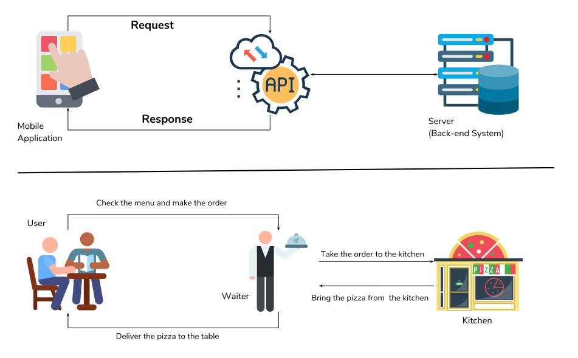

# Använda ChatGPT via API med Python
 


---


## Vad är ChatGPT?
- AI utvecklad av OpenAI.
- ChatGPT är en s.k. Large Language Model
- Det finns även fler LLMs, exempelvis Gemini, Claude m.m.
- Kan generera text, svara på frågor, och mycket mer.


---

<!-- .slide: data-background="#dddddd" -->
## Vad är ett API?
- API står för Application Programming Interface.
- Ett verktyg för program att kommunicera med varandra.
- Du kan använda ChatGPT genom att gå till OpenAIs webbsida...
- ...men även genom att skicka frågor och tar emot svar programmatiskt. 

--

<!-- .slide: data-background="#dddddd" -->
## Vad är ett API?

 


---


## Hur ansluter man till ChatGPT via API?
- För att använda API:n behövs en API nyckel.
- Denna nyckeln är specifik till ett sammanhang, exempelvis en app eller program.
- Ett API-anrop med Python kan se ut så här.
- Obs openai biblioteket måste installeras i Thonny.


--

## Hur ansluter man till ChatGPT via API?

```python
from openai import OpenAI

client = OpenAI(api_key='sk...')

completion = client.chat.completions.create(
  model="gpt-3.5-turbo",
  messages=[
    {"role": "system", "content": "You are a poetic assistant, skilled in explaining complex programming concepts with creative flair."},
    {"role": "user", "content": "Compose a poem that explains the concept of recursion in programming."}
  ]
)

print(completion.choices[0].message.content)
```


---


## Parametrar?
- client.chat.completions.create() tar ett antal parametrar.
- "model" är versionen som ska användas (gpt-3.5-turbo)
- "messages" är de olika meddelanden som ChatGPT ska ta hänsyn till när den bildar ett svar.
- Vilket format har "messages"?
- För att fortsätta en chat måste både språkmodellens och dina meddelanden las till i "messages."

--

## Parametrar?

```python
completion = client.chat.completions.create(
  model="gpt-3.5-turbo",
  messages=[
    {"role": "system", "content": "You are a poetic assistant, skilled in explaining complex programming concepts with creative flair."},
    {"role": "user", "content": "Compose a poem that explains the concept of recursion in programming."}
  ]
)
```

---


## Tack för idag!
